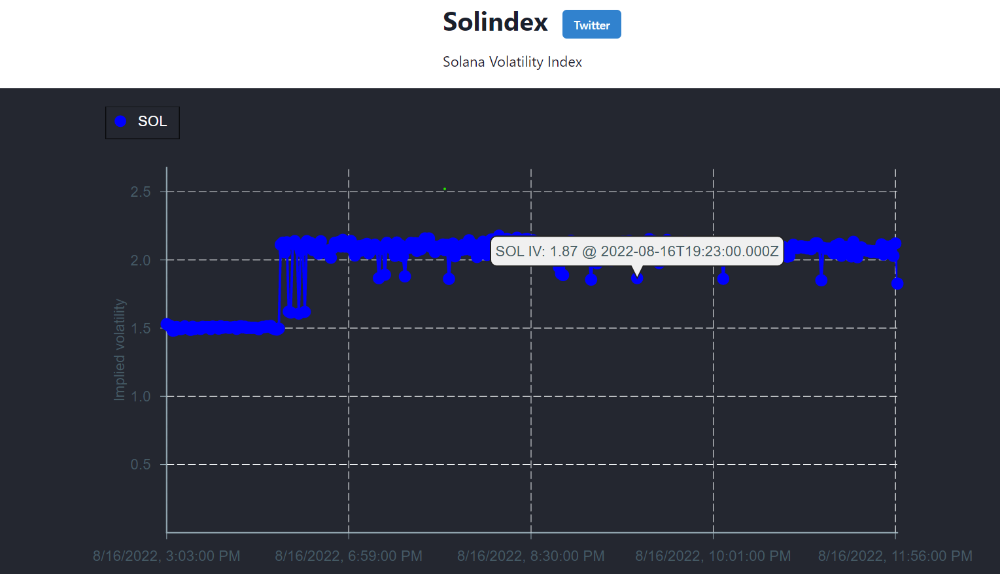
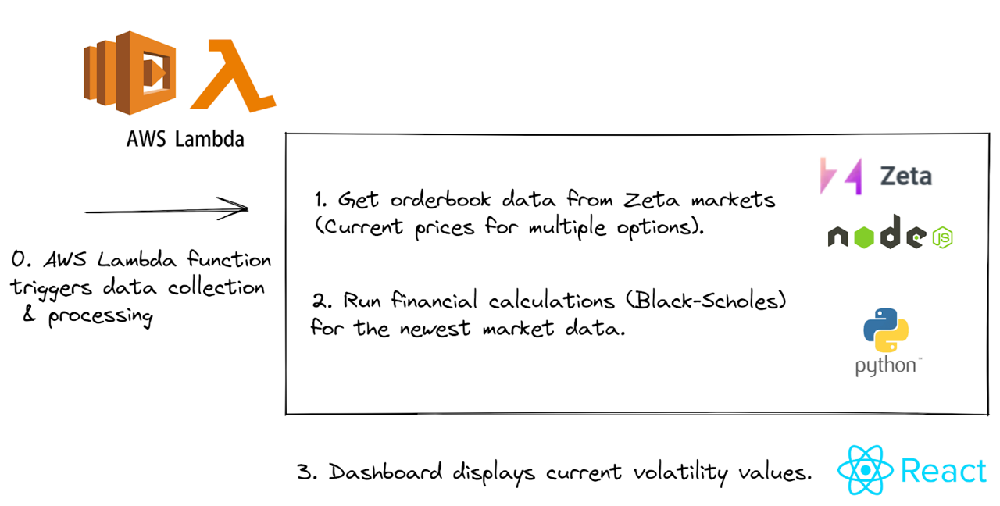

# Solana Volatility Index

App: https://frontend-axj2520gm-gabrielfior.vercel.app/

## Tools used

Solindex is a volatility index for Solana, initially only for SOL.

The project has 3 main components:
- Data fetching: only data from Zeta.markets is being fetched, using their [sdk](https://github.com/zetamarkets/sdk)
- Data processing: extracting implied volatility from the marked price of call/put options is performed, whereas the average value is taken from all the different expiry/strike combinations (for a given underlying). We use a Black-Scholes model.
- Data visualization: displaying the implied volatility as a function of time (as seen in the screenshot above).

(Possible) next steps:
- Make data publicly available through a GraphQL API
- Deploy a token for Solindex
- Create a vAMM for Solindex for incrased liquidity
- Partner with protocols for building financial products on top of Solindex, such as perpetual futures and/or options.

Team: [Gabriel](https://twitter.com/wiskDev) & [Jonas](https://twitter.com/DeinJoni)